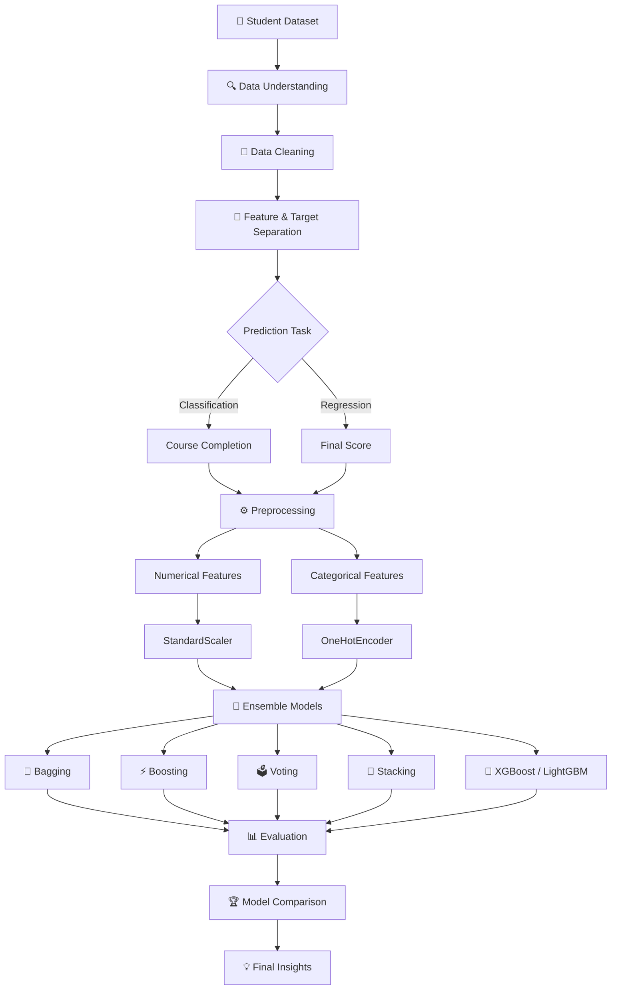

# 🎓 Smart Outcome Predictor

<p align="center">
  
</p>

<p align="center">

<a href="https://github.com/dhorajiyamisri/smart-outcome-predictor">

</a>


</p>

<p align="center">

<strong>📊 Classification + Regression + Ensemble Learning</strong>

</p>

<p align="center">
  <a href="#-overview">Overview</a> •
  <a href="#-results">Results</a> •
  <a href="#-workflow">Workflow</a> •
  <a href="#-models">Models</a> •
  <a href="#-mathematics">Mathematics</a> •
  <a href="#-interview-guide">Interview</a>
</p>

---

## 🚀 Overview

**Smart Outcome Predictor** is an end-to-end Machine Learning project that analyzes student learning behavior, engagement, assessment activity, attendance, and course information to predict academic outcomes.

The project solves **two Machine Learning problems simultaneously**:

### 🎯 Classification

Predict whether a student will complete a course.

**Target:** `completion_status`

* `0` → Not Completed
* `1` → Completed

### 📈 Regression

Predict a student's final academic score.

**Target:** `final_score`

* Continuous value
* Range: `0–100`

The project goes beyond a single algorithm by implementing and comparing multiple **ensemble learning techniques**, including Bagging, Boosting, Voting, Stacking, LightGBM, and XGBoost.

---

# 🧠 Why This Project?

Educational platforms collect enormous amounts of learner activity data.

However, raw data alone does not answer questions such as:

> **Will this student complete the course?**

or

> **What final score is this student likely to achieve?**

This project converts behavioral and academic signals into predictive insights.

### Potential use cases

* 🎓 Early identification of students who may need support
* 📚 Learning engagement analysis
* 📊 Academic performance prediction
* 🧑‍🏫 Data-driven intervention planning
* 🏫 Educational analytics
* 🤖 Intelligent learning platforms

---

# ✨ Key Highlights

| Capability            | Implementation                           |
| --------------------- | ---------------------------------------- |
| 🎯 Classification     | Course completion prediction             |
| 📈 Regression         | Final score prediction                   |
| 🧹 Preprocessing      | Scaling + One-Hot Encoding               |
| 🌳 Bagging            | Bagging Classifier / Regressor           |
| ⚡ Boosting            | AdaBoost / Gradient Boosting             |
| 🚀 Advanced Boosting  | LightGBM / XGBoost                       |
| 🗳️ Voting            | Hard & Soft Voting                       |
| 🧠 Stacking           | Classification & Regression              |
| 📊 Evaluation         | Accuracy, Precision, Recall, F1, ROC-AUC |
| 📐 Regression Metrics | MAE, RMSE, MSE, R²                       |

---

# 📊 Dataset

The project uses a dataset containing student demographic, course, engagement, and academic activity information.

### Feature groups

#### 👤 Student Information

* `age`
* `country_region`
* `device_type`
* `education_background`

#### 📚 Course Information

* `course_level`
* `course_category`
* `course_start_date`
* `week_of_year`

#### ⏱️ Learning Engagement

* `sessions`
* `time_spent_hours`
* `videos_watched`
* `quiz_attempts`

#### 📝 Academic Activity

* `assignments_submitted`
* `forum_posts`
* `avg_quiz_score`
* `attendance_rate`

### Targets

```text
Classification → completion_status
Regression     → final_score
```

The notebook explicitly separates the features from these two targets.

---

# 🔄 Workflow



---

# 🧹 Data Preprocessing

The project uses a dedicated preprocessing pipeline for numerical and categorical variables.

### Numerical preprocessing

Numerical variables are standardized using:

```python
StandardScaler()
```

### Categorical preprocessing

Categorical variables are transformed using:

```python
OneHotEncoder(handle_unknown="ignore")
```

The notebook implements this using `ColumnTransformer`, separating numerical and categorical columns.

### Train-Test Split

```python
train_test_split(
    X,
    y,
    test_size=0.2,
    random_state=42
)
```

An 80/20 split is used for both classification and regression tasks.

---

# 🌳 Ensemble Learning

Instead of depending on one weak or unstable learner, ensemble learning combines multiple learners to improve predictive performance.

This project explores three major ensemble philosophies:

```text
Bagging
   ↓
Reduce Variance

Boosting
   ↓
Reduce Bias

Voting / Stacking
   ↓
Combine Different Models
```

---

# 🌳 Bagging

## Bagging Classifier

The Bagging Classifier uses multiple Decision Tree estimators.

### Result

**Accuracy: 69.33%**

Confusion Matrix:

```text
[[522 125]
 [194 199]]
```

---

## 📈 Bagging Regressor

### Result

| Metric |    Score |
| ------ | -------: |
| MSE    | 101.2615 |
| R²     |   0.4580 |

---

# ⚡ Boosting Algorithms

## AdaBoost

AdaBoost focuses progressively on difficult observations by assigning greater importance to incorrectly predicted samples.

### Classification

**Accuracy: 73.37%**

Confusion Matrix:

```text
[[543 104]
 [173 220]]
```

### Regression

| Metric |    Score |
| ------ | -------: |
| MSE    | 113.0597 |
| R²     |   0.3949 |

---

# 📈 Gradient Boosting

### Classification

**Accuracy: 71.54%**

### Regression

| Metric |   Score |
| ------ | ------: |
| MSE    | 98.7132 |
| R²     |  0.4717 |

---

# 🚀 XGBoost & LightGBM

The project also evaluates two highly popular gradient boosting frameworks.

## XGBoost

### Classification

**Accuracy: 71.06%**

### Regression

| Metric |   Score |
| ------ | ------: |
| MSE    | 97.9012 |
| R²     |  0.4760 |

---

## LightGBM

### Classification

**Accuracy: 70.19%**

### Regression

| Metric |    Score |
| ------ | -------: |
| MSE    | 102.2667 |
| R²     |   0.4526 |

---

# 🗳️ Voting Ensemble

Voting combines predictions from multiple base learners.

The project compares:

* Hard Voting
* Soft Voting

### Results

| Strategy        |   Accuracy |
| --------------- | ---------: |
| 🗳️ Hard Voting | **72.79%** |
| 🧠 Soft Voting  | **71.92%** |

Interestingly, **Hard Voting performs better than Soft Voting** in this experiment.

---

# 🧠 Stacking Ensemble

Stacking takes ensemble learning one step further.

Instead of simply voting, predictions from base models are passed to a **meta-learner**.

### Classification

**Accuracy: 72.60%**

### Regression

**R²: 49.74%**

**MSE: 93.91**

---

# 🏆 Model Comparison

## 🎯 Classification

| Model                |      Accuracy |
| -------------------- | ------------: |
| 🌳 Decision Tree     |        63.27% |
| 🌳 Bagging           |    **69.33%** |
| 💡 LightGBM          |    **70.19%** |
| 🚀 XGBoost           |    **71.06%** |
| 📈 Gradient Boosting |    **71.54%** |
| 🗳️ Soft Voting      |    **71.92%** |
| 🧠 Stacking          |    **72.60%** |
| 🗳️ Hard Voting      |    **72.79%** |
| ⚡ **AdaBoost**       | **73.37% 🏆** |

Decision Tree, Bagging, AdaBoost, Gradient Boosting, LightGBM and XGBoost results are taken directly from the notebook outputs.

### 🏆 Classification Winner

> **AdaBoost Classifier — 73.37% Accuracy**

---

# 📈 Regression Comparison

| Model             |         MSE |            R² |
| ----------------- | ----------: | ------------: |
| AdaBoost          |    113.0597 |        0.3949 |
| LightGBM          |    102.2667 |        0.4526 |
| Bagging           |    101.2615 |        0.4580 |
| Gradient Boosting |     98.7132 |        0.4717 |
| XGBoost           |     97.9012 |        0.4760 |
| 🧠 **Stacking**   | **93.9101** | **0.4974 🏆** |

The regression values above come from the notebook's executed outputs.

### 🏆 Regression Winner

> **Stacking Regressor — R² = 0.4974**

---

# 💎 Result Cards

<table>
<tr>
<td align="center">

### 🎯 73.37%

**Best Classification Accuracy**

AdaBoost

</td>

<td align="center">

### 🧠 49.74%

**Best Regression R²**

Stacking

</td>

<td align="center">

### 📉 93.91

**Lowest Regression MSE**

Stacking

</td>

<td align="center">

### 📊 0.7709

**ROC-AUC**

Soft Voting

</td>
</tr>
</table>

The final classification evaluation reports Accuracy = 0.7192, Precision = 0.7128, Recall = 0.7192, F1 = 0.7102 and ROC-AUC = 0.7709 for the evaluated Soft Voting model.

---

# 📊 Final Evaluation

## Classification Metrics

| Metric    |      Score |
| --------- | ---------: |
| Accuracy  | **71.92%** |
| Precision | **71.28%** |
| Recall    | **71.92%** |
| F1-Score  | **71.02%** |
| ROC-AUC   | **77.09%** |

---

## Regression Metrics

| Metric |      Score |
| ------ | ---------: |
| MAE    | **7.7645** |
| RMSE   | **9.6907** |
| R²     | **0.4974** |

---

# 📐 Mathematics Behind the Models

## 🎯 Classification

For binary classification, a model estimates the probability:

$$
P(y=1|X)
$$

where:

* \(y\) = course completion status
* \(X\) = student features

A probability threshold can then be used to convert the prediction into a class.

---

## 📊 Accuracy

$$
Accuracy =
\frac{TP+TN}{TP+TN+FP+FN}
$$

Where:

* TP = True Positive
* TN = True Negative
* FP = False Positive
* FN = False Negative

---

## 🎯 Precision

$$
Precision =
\frac{TP}{TP+FP}
$$

Precision answers:

> Of all students predicted as completed, how many were actually completed?

---

## 🔍 Recall

$$
Recall =
\frac{TP}{TP+FN}
$$

Recall answers:

> Of all students who actually completed, how many did the model identify?

---

## ⚖️ F1 Score

$$
F1 =
2 \times
\frac{Precision \times Recall}
{Precision + Recall}
$$

F1 balances precision and recall.

---

# 📈 Regression Mathematics

## Mean Squared Error

$$
MSE =
\frac{1}{n}
\sum_{i=1}^{n}
(y_i-\hat{y_i})^2
$$

MSE penalizes larger prediction errors more strongly because the errors are squared.

---

## Mean Absolute Error

$$
MAE =
\frac{1}{n}
\sum_{i=1}^{n}
|y_i-\hat{y_i}|
$$

MAE gives the average absolute prediction error.

---

## Root Mean Squared Error

$$
RMSE =
\sqrt{
\frac{1}{n}
\sum_{i=1}^{n}
(y_i-\hat{y_i})^2
}
$$

RMSE is expressed in the same unit as the target variable.

---

## R² Score

$$
R^2 =
1 -
\frac{\sum(y_i-\hat{y_i})^2}
{\sum(y_i-\bar{y})^2}
$$

R² measures how much variance in the target is explained by the model.

---

# 🧠 How Stacking Works

The Stacking architecture can be represented as:

```text
                Student Features
                       │
        ┌──────────────┼──────────────┐
        ↓              ↓              ↓
   Linear Model   Decision Tree      SVR
        │              │              │
        └──────────────┼──────────────┘
                       ↓
                Base Predictions
                       │
                       ↓
                 Meta Learner
                       │
                       ↓
                Final Prediction
```

In the implemented regression stack, the base estimators are:

* Linear Regression
* Decision Tree Regressor
* SVR

with a Linear Regression final estimator.

---

# 🔬 Technical Architecture

```text
                 ┌───────────────────────┐
                 │   Student Activity    │
                 │       Dataset         │
                 └───────────┬───────────┘
                             │
                             ▼
                 ┌───────────────────────┐
                 │ Data Preparation      │
                 │ Cleaning + Splitting  │
                 └───────────┬───────────┘
                             │
                 ┌───────────┴───────────┐
                 ▼                       ▼
        ┌─────────────────┐     ┌─────────────────┐
        │ Classification  │     │   Regression    │
        │ Completion      │     │ Final Score     │
        └────────┬────────┘     └────────┬────────┘
                 │                       │
                 └───────────┬───────────┘
                             ▼
                 ┌───────────────────────┐
                 │   Preprocessing       │
                 │                       │
                 │ StandardScaler        │
                 │ OneHotEncoder         │
                 └───────────┬───────────┘
                             │
                             ▼
                 ┌───────────────────────┐
                 │ Ensemble Algorithms   │
                 │                       │
                 │ Bagging               │
                 │ Boosting              │
                 │ XGBoost               │
                 │ LightGBM              │
                 │ Voting                │
                 │ Stacking              │
                 └───────────┬───────────┘
                             │
                             ▼
                 ┌───────────────────────┐
                 │ Model Evaluation      │
                 └───────────┬───────────┘
                             │
                    ┌────────┴────────┐
                    ▼                 ▼
               Classification     Regression
               Metrics             Metrics
```

---

# 🧪 Interview-Level Explanation

## ❓ Why use ensemble learning?

A single model may have limitations.

For example:

* Decision Trees can have high variance.
* A weak learner may underfit.
* Different algorithms capture different patterns.

Ensemble learning combines multiple learners to improve generalization.

---

## ❓ Bagging vs Boosting?

### Bagging

Models are trained more independently and their predictions are aggregated.

**Primary goal: reduce variance.**

Example:

```text
Decision Trees
      ↓
Multiple Trees
      ↓
Aggregation
      ↓
Final Prediction
```

### Boosting

Models are trained sequentially, with later learners focusing on errors made by earlier learners.

**Primary goal: reduce bias and improve predictive performance.**

---

## ❓ Why is AdaBoost the best classifier here?

In the executed experiments, AdaBoost achieved the highest classification accuracy among the listed ensemble models:

$$
Accuracy = 0.73365
$$

or approximately:

**73.37%**

This means AdaBoost performed best on the specific train/test experiment used in the notebook.

It does **not** mean AdaBoost is universally the best algorithm.

---

## ❓ Why is Stacking the best regression model?

Stacking combines multiple types of regressors and uses a meta-learner to learn how to combine their predictions.

In this experiment:

$$
R^2 = 0.4974
$$

and

$$
MSE = 93.91
$$

The Stacking Regressor therefore produced the strongest regression result among the evaluated regression models in this notebook.

---

## ❓ Why use One-Hot Encoding?

Machine Learning algorithms generally require numerical representations.

Categorical features such as:

```text
device_type
course_level
course_category
education_background
country_region
```

are therefore transformed into numerical indicator variables.

The project uses:

```python
OneHotEncoder(handle_unknown="ignore")
```

which also helps the pipeline handle previously unseen categories during transformation.

---

## ❓ Why use StandardScaler?

Features can have very different numerical scales.

For example:

```text
age              → small range
time_spent       → larger range
attendance_rate  → percentage
```

Standardization transforms a feature approximately as:

$$
z = \frac{x-\mu}{\sigma}
$$

where:

* \(\mu\) = mean
* \(\sigma\) = standard deviation

---

# ⚠️ Important Model Insight

The classification results show that **accuracy alone should not be used to judge model quality**.

For example, the evaluated Soft Voting model achieved:

* Accuracy → 71.92%
* Precision → 71.28%
* Recall → 71.92%
* F1 → 71.02%
* ROC-AUC → 77.09%

The class-specific report also shows different precision/recall behavior between classes.

For an educational intervention system, this distinction matters because a **false negative** could mean failing to identify a student who needs additional support.

---

# 📌 Key Findings

### 🥇 Classification

**AdaBoost** achieved the highest recorded classification accuracy:

> **73.37%**

### 🥇 Regression

**Stacking Regressor** achieved:

> **R² = 0.4974**

and:

> **MSE = 93.91**

### 🔎 Ensemble Learning

The experiments demonstrate that combining models can outperform the single Decision Tree baseline used in the notebook.

### 📊 Evaluation

The project evaluates classification using multiple metrics rather than relying exclusively on accuracy.

---

# 📁 Project Structure

```text
smart-outcome-predictor/
│
├── 📊 Smart_Outcome_Predictor_Dataset_5200(Sheet1).csv
│
├── 📓 smart outcome predictor.ipynb
│
├── 📄 Part A Theory.pdf
│
└── 📖 README.md
```

---

# 🛠️ Tech Stack

| Technology          | Purpose                       |
| ------------------- | ----------------------------- |
| 🐍 Python           | Programming                   |
| 🐼 Pandas           | Data manipulation             |
| 🔢 NumPy            | Numerical computation         |
| 📊 Matplotlib       | Visualization                 |
| 🎨 Seaborn          | Data visualization            |
| 🤖 Scikit-learn     | Machine Learning              |
| 🚀 XGBoost          | Gradient boosting             |
| 💡 LightGBM         | Gradient boosting             |
| 📓 Jupyter Notebook | Development & experimentation |
| 🔀 Git/GitHub       | Version control               |

---

# ⚙️ Installation

### 1️⃣ Clone the repository

```bash
git clone https://github.com/dhorajiyamisri/smart-outcome-predictor.git
```

### 2️⃣ Navigate to the project

```bash
cd smart-outcome-predictor
```

### 3️⃣ Install dependencies

```bash
pip install pandas numpy matplotlib seaborn scikit-learn xgboost lightgbm jupyter
```

### 4️⃣ Launch Jupyter Notebook

```bash
jupyter notebook
```

### 5️⃣ Open

```text
smart outcome predictor.ipynb
```

---

# ▶️ Reproducibility

The experiments use:

```python
random_state=42
```

for train-test splitting and model configurations where applicable.

This makes the demonstrated experiment reproducible under the same environment and data conditions.

---

# 🔮 Future Improvements

This project can be extended into a production-ready educational analytics platform.

### 🚀 Model Improvements

* Hyperparameter optimization
* Cross-validation
* Probability calibration
* Class imbalance analysis
* Feature selection
* Explainable AI with SHAP
* Automated model comparison

### 🌐 Deployment

Build an interactive:

```text
Student Data
     ↓
Streamlit Application
     ↓
ML Prediction API
     ↓
Outcome Dashboard
```

### 📊 Dashboard

A future dashboard could display:

* Completion probability
* Predicted final score
* Engagement level
* Attendance impact
* Quiz performance
* Risk indicators
* Recommended intervention

---

# 👩‍💻 Author

### Misri Dhorajiya

📌 Data Science & Machine Learning Enthusiast

🔗 **GitHub:**
https://github.com/dhorajiyamisri

🔗 **Project Repository:**
https://github.com/dhorajiyamisri/smart-outcome-predictor

---

<p align="center">

### ⭐ If you found this project useful, consider giving it a star!

**Built with 🐍 Python • 🤖 Machine Learning • 📊 Data Science**

</p>

<p align="center">
  
</p>
